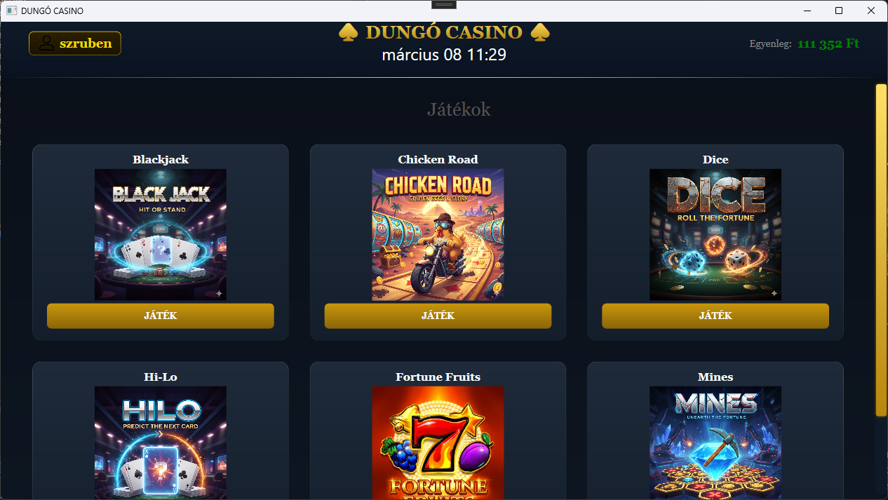
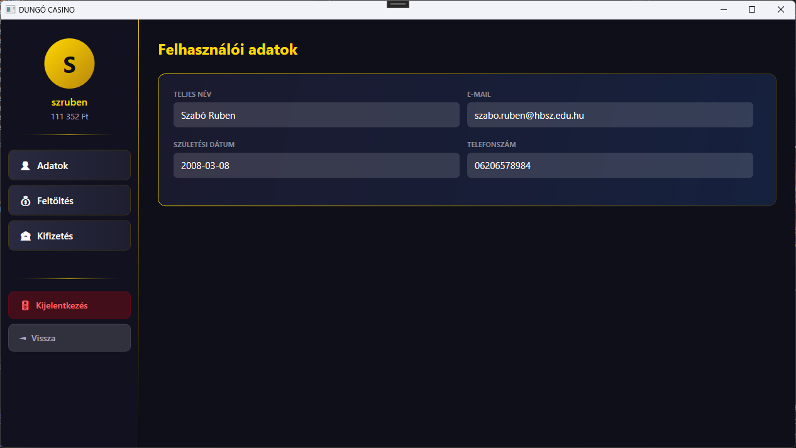

# 🎰 Dungó Casino

> **Prezentáció:** [https://www.canva.com/design/DAHDWWsCggQ/ZfUOtvqy4ct4OdBvvVqGHg/edit?utm_content=DAHDWWsCggQ&utm_campaign=designshare&utm_medium=link2&utm_source=sharebutton]

Dungó Casino egy WPF-alapú asztali szerencsejáték alkalmazás, amely 6 különböző játékot, felhasználói fiókkezelést, egyenlegfeltöltést és kifizetést kínál.

---

## 📋 Tartalom

- [Funkciók](#-funkciók)
- [Telepítés](#-telepítés)
- [Fiókkezelés](#-fiókkezelés)
- [Játékok](#-játékok)
  - [Blackjack](#blackjack)
  - [Chicken Road](#chicken-road)
  - [Dice](#dice)
  - [Hi-Lo](#hi-lo)
  - [Fortune Fruits (Slot)](#fortune-fruits-slot)
  - [Mines](#mines)
- [Profil & Pénzügyek](#-profil--pénzügyek)
- [Technikai felépítés](#-technikai-felépítés)

---

## ✨ Funkciók

- Bejelentkezés és regisztráció felhasználónévvel vagy e-mail-lel
- Valós idejű egyenlegkezelés játékok között
- Egyenleg feltöltése és kifizetése bankkártyával vagy banki átutalással
- IBAN / kártyaszám validáció
- 6 különböző játék
- Reszponzív UI – kisebb ablakmérethez igazodik
- Fájl alapú adattárolás (`adatok.txt`)
- Élő óra megjelenítés a főoldalon

---

## 🚀 Telepítés

1. Klónozd a repót:
   ```
   git clone https://github.com/felhasznalonev/dungo-casino.git
   ```
2. Nyisd meg Visual Studióban (`.sln` fájl)
3. Build & Run (F5)
4. Az `adatok.txt` fájl automatikusan létrejön az első regisztrációkor

**Követelmények:**
- Windows 10/11
- .NET Framework / .NET (WPF)
- Visual Studio 2022

---

## 👤 Fiókkezelés

### Regisztráció
A regisztrációhoz az alábbi adatok szükségesek:
- **Teljes név** – nagybetűvel kezdődő, valós névformátum (pl. `Kovács János`)
- **E-mail** – érvényes e-mail formátum (pl. `pelda@gmail.com`)
- **Felhasználónév**
- **Telefonszám** – magyar vagy nemzetközi formátum (pl. `+36201234567`)
- **Jelszó** – min. 8 karakter, 1 nagybetű, 1 szám, 1 speciális karakter
- **Születési dátum** – min. 18 éves kor szükséges

### Bejelentkezés
Bejelentkezni felhasználónévvel **vagy** e-mail-lel is lehet.

---

## 🎮 Játékok

### Blackjack

A klasszikus kártyajáték. A cél, hogy a lapjaid összege minél közelebb legyen 21-hez, de ne haladja meg.

**Szabályok:**
- Számlapok (2–10) névértéken számítanak
- J, Q, K értéke 10
- Ász értéke 11 (ha meghaladná a 21-et, automatikusan 1-re vált)
- Az osztó addig húz, amíg el nem éri a 17-et

**Gombok:**
| Gomb | Leírás |
|------|--------|
| **Deal** | Játék indítása a beállított téttel |
| **Hit** | Új lap húzása |
| **Stand** | Megállás, osztó húz |
| **Double** | Tét megduplázása + 1 lap, majd automatikus stand (csak az első körben) |
| **Rebet** | Előző tét megismétlése |

**Kifizetések:**
- Nyerés: tét × 2
- Döntetlen: tét visszakapva
- Vesztés: tét elvész

---

### Chicken Road

Vezess egy csirkét az úton át, minél messzebb jutsz, annál nagyobb a szorzó – de bármikor meghalhatsz!

**Nehézségi szintek:**
- **Könnyű** – 24 mező, kisebb szorzók (max ~19×)
- **Nehéz** – 20 mező, nagyobb szorzók (max ~41321×)

**Játékmenet:**
1. Válassz nehézséget és tétet
2. Nyomd meg a **Go** gombot minden lépéshez
3. A csirke véletlenszerű mezőn meghal – minél messzebb jutsz, annál nagyobb a szorzó
4. **Cash Out** gombbal bármikor kiveheted a nyereményed

---

### Dice

Tippelj egy 1–99 közötti számra, és döntsd el, hogy a dobott szám felette vagy alatta lesz-e.

**Játékmenet:**
1. Állítsd be a tétet
2. Húzd a slidert a kívánt értékre
3. Válassz: **Felette** vagy **Alatta**
4. Nyomd meg a **Dob** gombot

**Szorzó számítás:** minél szélsőségesebb a tipp, annál nagyobb a szorzó (pl. „99 felett" ~96×, de szinte lehetetlen)

**Extra funkciók:**
- **Auto Bet** – megadott számú automatikus dobás
- **Végtelen mód** – folyamatos automatikus dobás
- Előzmény lista az utolsó 20 dobásról

---

### Hi-Lo

Tippeld meg, hogy a következő kártya nagyobb vagy kisebb lesz-e az aktuálisnál!

**Kártyaértékek:** 2 (legkisebb) → A = 14 (legnagyobb)

**Játékmenet:**
1. Állítsd be a tétet, majd nyomd meg a **Deal** gombot
2. Tippelj: **Higher** (nagyobb) vagy **Lower** (kisebb)
3. Minden helyes tipp után a nyeremény szorzódik
4. **Cash Out** gombbal kiveheted az aktuális nyereményed
5. Rossz tipp esetén elveszted a teljes tétet

**Szorzó:** az aktuális kártya értékétől és a tipp irányától függ – minél valószínűtlenebb, annál nagyobb.

---

### Fortune Fruits (Slot)

Klasszikus 3×3-as nyerőgép 5 nyervonallal és 9 különböző szimbólummal.

**Szimbólumok (értékes → kevésbé értékes):**
| Szimbólum | Szorzó (3×) |
|-----------|------------|
| 7 🔴 | 1000× |
| ⭐ | 500× |
| 🔔 | 200× |
| 🍉 🍇 | 150× |
| 🍑 🍋 🍊 🍒 | 80× |

**Nyervonalak:** középső sor, felső sor, alsó sor, átló ↘, átló ↗

**Beállítások:**
- **Érme értéke:** 100 – 20 000 Ft
- **Tét szorzó:** 50 – 1000
- **Turbo mód** – gyorsabb pörgetés
- **Auto mód** – folyamatos automatikus pörgetés

---

### Mines

*(Hamarosan részletes leírás)*

---

## 💰 Profil & Pénzügyek

### Egyenleg feltöltése
- Gyorsgombok: 1 000 / 5 000 / 10 000 / 50 000 Ft
- Egyéni összeg megadása
- Fizetési mód: Bankkártya vagy Banki átutalás
- **Bankkártya validáció:** pontosan 16 számjegy
- **Banki átutalás validáció:** 16 vagy 24 számjegyű magyar számlaszám, vagy IBAN (pl. `HU42117730161111101800000000`)

### Egyenleg kifizetése
Ugyanazok az opciók mint a feltöltésnél, de csak az elérhető egyenlegig fizethető ki.

---

## 🛠 Technikai felépítés

| Technológia | Leírás |
|-------------|--------|
| **C# / WPF** | Asztali alkalmazás fejlesztése |
| **XAML** | UI definíció |
| **.NET** | Runtime |
| **Fájl alapú DB** | `adatok.txt` – pontosvesszővel elválasztott adatok |
| **EgyenlegManager** | Statikus singleton az egyenleg és felhasználónév kezelésére |
| **NavigationService** | Oldalak közötti navigáció Frame-en belül |
| **Regex validáció** | Név, email, telefonszám, jelszó ellenőrzés regisztrációnál |

### Adatfájl formátuma (`adatok.txt`)
```
Teljes Név;email@cim.hu;felhasznalonev;+36201234567;Jelszo1!;2000-01-01;10000
```

---

## 📸 Képernyőképek

| Bejelentkezés | Főoldal | Profil |
|---|---|---|
|  |  |  |
